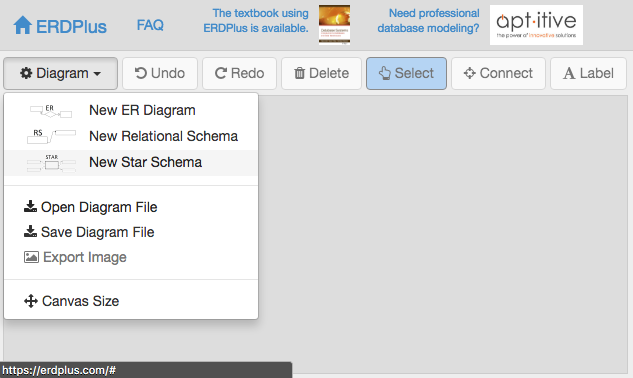
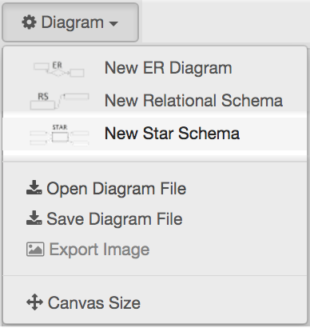
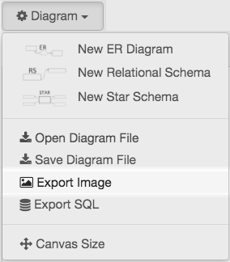
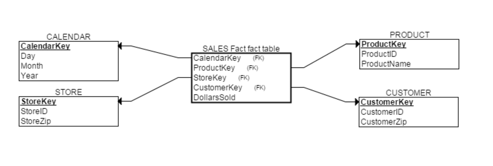
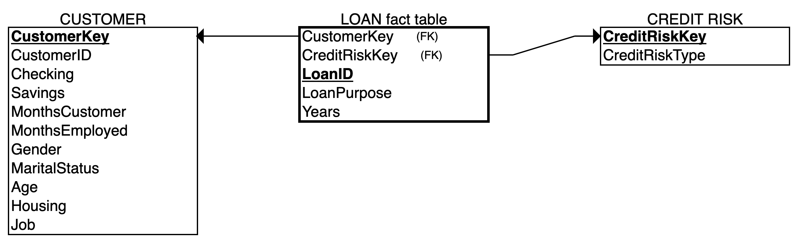

### About

This worksheet includes two main tasks: data modeling (a key step to understanding the data), and calculating a signal-to-noise ratio.


### Note

Read carefully the instructions on Sakai. For clarity, questions are highlighted in red color and numbered according to their particular placement in the task section.  Quite often you may need to add your own code chunk.

Execute all code chunks, save your work, preview, and submit your final **lab03.html.nb** file in Sakai.

--------------

### Task 1: Data Modeling

Before any data modeling first step is to examine and understanding the content of the csv file 'creditrisk.csv'. You can do this in different ways by opening the file in Excel, or by viewing the file in RStudio using File -> Import Dataset -> From Text (base) in RStudio for that purpose.

<span style="color:red">
##### 1A) For each column variable (total of 12) determine the type of data from the following four options: Numerical Ratio (Continuous), Numerical Interval (Discrete), Categorical Nominal (regular), and Categorical Ordinal (order) (2pts)
 </span>
 
<span style="color:blue">
Numerical Ratio (Continuous): Checking, Savings </br>
Numerical Interval (Discrete): Months Customer, Months Employed, Age, Years </br>
Categorical Nominal (regular): Loan Purpose, Gender, Marital Status, Housing, Job </br>
Categorical Ordinal (order): Credit Risk </br>
</span>

Whether we are dealing with structured or unstructurred data, data modeling is an exercise to demonstrate our understanding of the data, not just from the data relational aspect,  but also from the business perspective. There are many database modeling tools available for the purpose of creating relational schemas.  For the purpose of this lab we will be using the online tool ERDPlus to create a star schema  [https://erdplus.com/#/standalone](https://erdplus.com/#/standalone). Use the **TRY IT!** feature which requires no signup and login.  Below are steps and an example to create a simple star relational schema in ERDPlus. 


##### Steps to create an star relation schema using erdplus.



##### From the drop-down option select **New Start Schema**



##### Example of how to create an start schema using erdplus


##### Completed Star schema example





Finally export the diagram as an image.



<span style="color:red">
##### 1B) Create a simple star relational schema representing the data in creditrisk.csv.  Once completed take a screenshot of the star schema image or select **Export Image**, and add it below. Consider using one fact table, and two dimension tables (3pts)
 </span>
 
To add a picture, follow the examples above or the detailed steps described in $\it labref.pdf$. 

 

-------------

### Task 2: Signal-to-Noise Ratio

First we read the csv file into R Studio, and store the data in an object we will call 'mydata'. The function 'head' is used to show us the first few lines of the data object 'mydata'.


```{r}
# Read file
mydata = read.csv(file="creditrisk.csv")
# Show header lines
head(mydata)
```

To select a particular column field from the data, we refer to the object 'mydata' followed by the '$' sign and the name of the column field as appearing in the data file. Be careful with capitalization as everything in RStudio is case sensitive. Below, we have extracted the checking column. 

```{r}
# Extracting the Checking Column. Save output in variable checking.
# Note the capitalization in referring to the column field name.
checking = mydata$Checking 

#Calling the Checking Column to display top head values
head(checking)
```

<span style="color:red">
##### 2A) Insert a new code chunk to extract instead the savings column. Be careful to use different variable naming (2pts)
</span>

```{r}
# Extract 'Savings' column and save to 'savings'
savings = mydata$Savings

# Display head values of 'savings'
head(savings)
```

In order to calculate the mean, or the average of the checking column, one can add each individual row entry and divide by the total number of rows. Luckily, R has a built-in command for this. We have done an example using the checking column. 

```{r}
#Using the 'mean' function to calculate the checking average and saving output in variable named 'meanChecking'
meanChecking = mean(checking)

#Calling the average
meanChecking
```

Similarly, we compute the standard deviation or spread of the checking column

```{r}
#Computing the standard deviation of checking
spreadChecking = sd(checking)
```

To compute the SNR, the signal to noise ratio, we simply take the mean, or average, divided by the spread. 

```{r}
# Compute the SNR of Checking and name it snr_Checking
snr_Checking = meanChecking/spreadChecking

# Call snr_Checking
snr_Checking
```

<span style="color:red">
##### 2B) Insert new code chunks to calculate instead the SNR for the savings column. Follow the instructions above. Watch your variable namings  to differentiate the checking calculations from the savings (2pts)
</span>

```{r}
# Calculate mean of 'savings'
meanSavings = mean(savings)

# Calculate standard deviation of 'savings'
spreadSavings = sd(savings)

# Calculate SNR of savings
snrSavings = meanSavings / spreadSavings

# Display 'snrSavings'
snrSavings
```


<span style="color:red">
##### 2C) Of the checking and savings data , which one has a higher SNR? What does it mean in terms of possible data quality? (1pt)
</span>

<span style="color:blue">
Savings has the higher SNR, which could potentially mean that there the Savings data is more condensed than the Checking data, resulting in more opportunities for actionable solutions and compararable data points.
</span>


