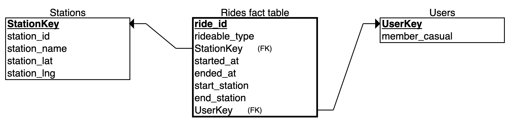

### About

This worksheet includes three main tasks on data outliers, data preparation, and data modeling. The lab requires the use of Microsoft Excel, R, and ERDplus.

### Note

Read carefully the instructions in Sakai. For clarity, questions are highlighted in red color and numbered according to their particular placement in the task section.  Quite often you may need to add your own code chunk.

Execute all code chunks, save your work, preview, and submit your final $\it lab04.nb.html$ file in Sakai.

--------------

### Task 1: Data Outliers (total 8pts)

We start by calculating the mean, standard deviation, maximum, and minimum for the Age column in the file. For this we read the file and extract the column field of interest.

```{r}
#Read File
mydata = read.csv(file="creditrisk.csv") 

#Name the extracted variable
age = mydata$Age 
```

<span style="color:red">
##### 1A) Fill in the code chunk below to calculate and display each result. Refer to previous labs, online help and search, to find the appropriate function names to use (2pts)
</span>

```{r}
# Calculate and display the average age  
avgAge = mean(age)
avgAge

# Calculate and display the standard deviation of age   
sdAge = sd(age)
sdAge

# Calculate and display the maximum age  
maxAge = max(age)
maxAge

# Calculate and display the minimum age  
minAge = min(age)
minAge
```

Next, we will use the formula discussed in class to detect any outliers. An outlier is a value that "lies outside" most of the other values in a set of data. A common way to estimate the upper and lower limits is to take the ```mean +/- 3 * standard deviation```.  

<span style="color:red">
##### 1B) Insert and execute the code chunk corresponding to the above formula to calculate the upper and lower limits for age. Display your results. Based on the limits do you think there are outliers? Explain your answer (2pts)
</span>

```{r}
# Calculate and display upper limit for age
ulAge = avgAge + 3 * sdAge
ulAge

# Calculate and display lower limit for age
llAge = avgAge - 3 * sdAge
llAge
```
<span style="color:blue">
I believe there are outliers because the maximum age of the dataset is 73, which is outside of upper limit calculated. The minimum age of the dataset was 18, which is within the lower limit and indicates there are are no indicators on the bottom half of the distribution.
</span>

Another method to find the upper and lower thresholds, requires calculating the interquartile range. Follow along below to see how we first calculate the interquartile range.

```{r} 
quantile(age) 
lowerq = quantile(age)[2]
upperq = quantile(age)[4]
iqr = upperq - lowerq
```

Next we calculate the limiting thresholds. A threshold here is the boundary that determines if a value is an outlier. If the value falls above the upper threshold or below the lower threshold, it is an outlier. 

To calculate the upper threshold:

```{r}
upperthreshold = (iqr * 1.5) + upperq 
upperthreshold
```

Below is the lower threshold:

```{r}
lowerthreshold = lowerq - (iqr * 1.5)
lowerthreshold
```

A good way to undertsand the above calculations is to visualize the results using a box and whisker plot. The top and lower ends of the box correspond to the upper and lower quartiles. The median is marked by a bolded line. The whiskers are the lines connecting the upper and lower quartiles to upper and lower thresholds. Any points beyond the thresholds is a potential outlier.

```{r} 
boxplot(age) 
```

<span style="color:red">
##### 1C) From the box plot representation are there any outliers? How many can you count? Explain how your answer compare with the result from Task 1B? (2pts)
</span>

<span style="color:blue">
From the box plot, I can count five outliers from the graphic, but there's a possibility there could be more that I cannot see due to overlapping in the graphic. In both tasks, it is clear there is an outlier, however Task 1C allows for the identification of how many there are rather than just the existence of one.
</span>

To answer the following question, you will need to consider the difference between a perfectly normal distribution and a generic distribution when accounting for an outlier.  

<span style="color:red">
##### 1D)  Given a set of data, which of the two methods described in 1B) and 1C) is more restrictive in accounting for outliers? Explain your logic. (2pts)
</span>

<span style="color:blue">
Task 1B is more restrictive because it can only effectively be applied to perfectly normal distributions and not generic distributions due to its calculation based on standard deviations. Task 1C's usage of medians and IQRs allows it to be dynamically applied to both types of distributions.
</span>

---------------

### Task 2: Data Preparation (total 4pts)

Next, we will read the unmodified file `creditriskorg.csv` as provided in its original form. Unlike the cleaned file `creditrisk.csv`, the original dataset will require some data preparation and cleanup.  

```{r}
# Read file and in a new data object name
newdata = read.csv(file="creditriskorg.csv")
# Show header lines
head(newdata)
```

Looking at the header lines we observe a new line is inserted with the header labels `X, X.1, ...` , and that the true column headers are shifted down.  This is because of the empty line in the original dataset. To correct for this detail we must skip one line when reading the file.

```{r}
# Read file while skipping 1st header line
newdata = read.csv(file="creditriskorg.csv",skip=1) 
head(newdata)
```

Next we want to extract the Checking column and then find the average of checking, similar to what we did in the previous lab.  When we try to execute the code chunk below notice that we get an error.

```{r}
# Extract the column field Checking from data object named newdata
# Note the capital 'C' in colun field name, and lower 'c' in variable name
checking = newdata$Checking  
# Calculate mean
mean(checking)
```
To resolve the error, we must understand first where it's source. There are missing values in the csv file represented by the symbol `$-`. Missing data is quite common as most datasets are not perfect. Additionally, there are commas within the excel spreadsheet, and R does not recognize that '1,234' is equivalent to '1234'. Lastly, there are '$' symbols throughout the file which is not a numerical symbol either.

To correct for the error we need to do some data cleanup. For this we will use the sub function `sub()` to replace unwanted symbols with something else. For example, in order to remove the comma in the number "1,234", we can substitute it with zero space. Below is a sequence of commands to help with the cleanup of the data in the Checking column and eventual calculation of the mean.

```{r}
# Substitute comma with zero space in all of checking  
# Note the re-use of variable name checking, which is equivalent to overriding
checking= sub(",","",checking)

# Substitute dollar sign with zero space in all of checking 
checking = sub("\\$","",checking)

# Convert values to numeric. 
# Any value that cannot be converted, will be replaced with NA (Not Applicable)
checking = as.numeric(checking)

#Calculate mean of checking with all NA entries removed 
mean(checking,na.rm=TRUE)
```

<span style="color:red">
##### 2A) Follow the above commands and insert a new code chunk to calculate the mean of the Savings column instead. Use a different variable name (2pts)
</span>

```{r}
# Extract the column field Savings from data object named newdata
savings = newdata$Savings  

# Substitute comma with zero space in all of savings
savings = sub(",", "", savings)

# Substitute dollar sign with zero space in all of savings 
savings = sub("\\$", "", savings)

# Convert values to numeric
savings = as.numeric(savings)

# Calculate mean of savings with all NA entries removed 
mean(savings, na.rm=TRUE)
```

<span style="color:red">
##### 2B) Separately calculate the mean of the Checking column in Excel using the Excel function `Average`. Compare the result from Excel to R (1pt)
</span>

<span style="color:blue">
The Excel mean calculated was `$2559.805` , which is equal to the R mean calculated.
</span>

<span style="color:red">
##### 2C) Based on the comparison of results in 2B) how did Excel treat the `$-` entries in the calculation of the mean, were they included or excluded ?  Explain your logic (1pt)
</span>

<span style="color:blue">
Considering that the Excel and R calculated means were equal, I would assume that Excel excluded the `$-` entries in the calculation.
</span>

-------------

### Task 3: Data Modeling (total 8pts)

Here, we will look at Chicago Divvy bike data. The historical data sets with a description of some fields can be found at:  

Chicago Divvy Data: [https://www.divvybikes.com/data](https://www.divvybikes.com/system-data)

First you need to download from the Divvy data site the zipped  data file `Divvy_Trips_2020_Q1.zip`.  A zipped data file is an archived or compressed file. Once downloaded you need to unarchive (unzip/uncompress) the file to extract its actual content.  You will then obtain the corresponding file `Divvy_Trips_2020_Q1.csv`. The file is of medium size, making it possible to still view in Excel.

<span style="color:red">
###### 3A) Open in RStudio or Excel the file `Divvy_Trips_2020_Q1.csv`. What is the size of the file (measured in bytes), the number of columns? the number of rows?. Identify the column field(s) in the data that can be used to uniquely identify each row entry in the data (2pts)
</span> 

<span style="color:blue">
The size of the file is `71.3MB` (or `74763468.8 bytes`) with `13` columns, and `426887` rows (including the column header row). The primary key is the `ride_id` column.
</span>

<span style="color:red">
###### 3B) Looking at the Divvy bike data define two business logic rules to check for data integrity violations: one for field integrity, and one for relationship integrity. (2pts)
</span>

<span style="color:blue">
A possible rule for field integrity could be checking for valid dates and times within the `started_at` and `ended_at` columns, assuring that the dates and time combinations are applicable to Q1 of 2020. For example, a `started_at` entry of `2019-01-21 20:06:59` and `ended_at` entry of `2019-01-21 20:14:30` would not be applicable to Q1 of 2020.
</span>

<span style="color:blue">
A possible rule for relationship integrity could be checking that a date and time in `ended_at` is not earlier than the respective `started_at` and vice versa. For example, a `started_at` entry of `2020-01-21 20:14:30` and `ended_at` entry of `2020-01-21 20:06:59` would not be valid.
</span>

<span style="color:red">
###### 3C) Using [https://erdplus.com/#/standalone](https://erdplus.com/#/standalone) draw a star like schema using the below three tables. Make sure to account for all column fields. A hand drawing is acceptable if nicely drawn, and legible. Include an image capture of your schema here (4pts)
</span> 

- A Fact table for Rides
- A Dimension table for Stations
- A Dimension table for Users

 


