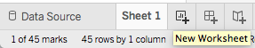

### About

R can be used for basic visual analytics, which is very helpful in understanding the data holistically. Additionally, R can help find correlations between variables and create scatter plots. 

Tableau is a tool more tailored for visual analytics, while R is a  powerful tool for statistics and other advanced topics in data analytics. In this lab  we will explore both capabilities using the two earlier sets of data for credit risk and marketing. 

### Note

Read carefully the instructions on Sakai. For clarity, questions are highlighted in red color and numbered according to their particular placement in the task section.  Quite often you may need to add your own code chunk.

Execute all code chunks, save your work, preview, and submit your final $\it lab06.nb.html$ file in Sakai.

--------------

### Task 1: Basic Visual Analytics in R (total 6pts)

Read the file `marketing.csv` and make sure all the columns are captured by checking the first couple  rows of the dataset "head(mydata)"

```{r}
mydata = read.csv("marketing.csv")
head(mydata)
```

How to create a bar chart using a categorical variable

```{r}
# Extract the State column from data object mydata
state = mydata$State
# Create a frequency table to extract the count for each state
state_table = table(state)
# Execute the  command 
barplot(state_table)
```

<span style="color:red">
##### 1A) Use the code chunk below to repeat the above bar chart by adding proper labels to X and Y axis (2pts)
</span>

```{r}
# Add title and labels to plot by replacing the ?? with the proper wordings
barplot(state_table, main = 'Number of Cases from Each State from \'marketing.csv\'', xlab= 'State', ylab = 'Number of Cases' )
```

A more elegant representation of the bar plot would be to order the bars by increasing value.  This is shown in the code chunk below.

```{r}
# Order and execute
barplot(state_table[order(state_table)])
```


Next we will create a histogram 
```{r}
# Extract the TV column from the data, and create a histogram by running the command hist(variable)
# In this case variable corresponds to the column for tv
tv=mydata$tv
hist(tv)
```

As seen, the histogram differs from a barplot in two distinctive ways: the x-axis is numeric (although not always necessary) broken in continuos intervals called bins, and the y-axis is representative of number of observations or frequency.  The number of bins can be adjusted to show a finer resolution or breakdown of intervals.  This is demonstrated in the below example.

```{r}
hist(tv, breaks=20)
```

<span style="color:red">
##### 1B) Create a new histogram plot for Sales. Explain what the x-axis and y-axis represent. Can one derive the total cummulative sales from the histogram? Explain your answer (2pts)
</span>

```{r}
# Extract 'sales' from dataset
sales = mydata$sales

# Create histogram of 'sales'
#hist(sales)

# Increase number of bins to 10
hist(sales, 
     breaks = 10,
     main = 'Sales from \'marketing.csv\'',
     xlab = 'Sales (in $1000s)',
     ylab = 'Frequency of Sales Range')
```

<span style="color:blue">
In the `sales` histogram, the x-axis represents the sales totals (in $1000s) from `$11000` to `$21000` in bins of `$1000` (after adjusting the number of bins to `10`) while the y-axis represents the number of cases with the respective amount of sales in each bin. 

It would not be possible to derive the actual number of cumulative sales from the histogram as the bins are representative of ranges, not actual figures.
</span>

How to create a pie chart
```{r}
# The command to create a pie chart is pie(variable) where  variable is in reference to the particular column extracted from the file. In this example use the variable for tv. 
pie(tv)
```
Looking at the pie chart for the variable $tv$ it is hard to visually compare the different slices and tell which is bigger or smaller.

<span style="color:red">
##### 1C) Insert a new code chunk to create a pie chart for state count. Refer to the earlier defined variable `state_table` to capture the frequency count (1pt)
</span>

```{r}
# Create pie chart of 'state_table'
pie(state_table, 
    main = 'Proportion of Cases in Each State from \'marketing.csv\'')
```


<span style="color:red">
##### 1D) What does each slice of the pie represent? Compare the pie chart to the earlier bar chart. Which type of charts is a better representation of the data and why so? (1pt)
</span>

<span style="color:blue">
Each slice represents the proportion of the number of cases from each state to the total number of cases in `marketing.csv`. 

<span style="color:blue">
The bar chart would be a better represenation of the data because it reveals the number of actual cases per state in the dataset, whereas the pie chart only reveals the proportions compared to other states in the dataset.
</span>


----------

### Task 2 Scatter Plots & Correlation (total 6pts)

The previous task focused on visualizing one variable. A good way to visualize two variables and also very common is a scatter plot. A scatter plot is well suited to study relationships and trends.

How to create a scatter plot
```{r}
# Plot Sales vs. Radio
# Radio will be on the x-axis
# Sales will be on the y-axis

sales = mydata$sales
radio = mydata$radio
plot(radio,sales)

# It is easier to see the trend and possible relationship by including a line that fit through the points.
# This is done with the command 
scatter.smooth(radio,sales)
```

<span style="color:red">
##### 2A) Insert a new code chunk to create three separate scatter plots for Sales vs TV, Sales vs Paper, and Sales vs Pos. Include the best fitting line in each plot. Pay attention to what variable goes on the x-axis and the y-axis. Label axis properly (2pts)
</span>

```{r}
# Create scatter plot with trendline of 'sales' vs. 'tv'
scatter.smooth(tv, 
               sales, 
               main = 'Sales vs. TV Commercials from \'marketing.csv\'', 
               xlab= 'TV Commercials (in $1000s)', 
               ylab = 'Sales (in $1000s)')

# Extract 'paper' from 'mydata'
paper = mydata$paper

# Create scatter plot with trendline of 'sales' vs. 'paper'
scatter.smooth(paper, 
               sales, 
               main = 'Sales vs. Newspaper Ads from \'marketing.csv\'', 
               xlab= 'Newspaper Ads (in $1000s)', 
               ylab = 'Sales (in $1000s)')

# Extract 'pos' from 'mydata'
pos = mydata$pos

# Create scatter plot with trendline of 'sales' vs. 'pos'
scatter.smooth(pos, 
               sales,
               main = 'Sales vs. POS Ad Cards from \'marketing.csv\'', 
               xlab= 'POS Ad Cards (in $1000s)', 
               ylab = 'Sales (in $1000s)')
```


<span style="color:red">
##### 2B) Share your observations on trends and relationships. How do your observations reconcile with your findings from lab05? (1pt)
</span>

<span style="color:blue">
For the `sales` vs. `radio` chart, it appears there is a strong, positive trend between the two variables. 

<span style="color:blue">
For the `sales` vs. `tv` chart, it appears there is a strong, positive trend between the two variables. 

<span style="color:blue">
For the `sales` vs. `paper` chart, it appears there is a strong, negative trend between the two variables until about `$17500` (in $1000s) in `sales` and `56` (in $1000s) in `paper`, which then begins to trend slightly positively. 

<span style="color:blue">
For the `sales` vs. `pos` chart, it appears there is a steady, neutral trend between the two variables until about `$16000` (in $1000s) in `sales` and `1.5` ad cards (in $1000s) in `pos`, which then begins to trend slightly negatively, and about `$17900` in `sales` and `1.0` in `pos`, which then begins to trend positively strong. 

<span style="color:blue">
From the first three charts (a `pos` scatter plot was not created in `lab05`), these new obesrvations reflect the trends observed from the individual `tv` and `paper` scatter plots when compared to `sales` scatter plot.
</span>

As part of any data anlytics it is important to consider both qualitative and quantitative analysis.  Scatter plots provide us with qualitative insights on possible trends and relationships.  To quantify the strength of any relationships in the data, we need to look at the correlation between two variables.

To compute the correlation coefficient or strength between variables follow the below example

```{r}
# Compute correlation between two variables. Order of variables is not relevant.
cor(sales,radio)
```

<span style="color:red">
##### 2C) Insert a new code chunk to calculate the correlation  for the following pair of variables  (sales,tv), (sales,paper), and (sales,pos) (1pt)
</span>

```{r}
# Compute correlation between 'sales' and 'tv'
cor(sales, tv)

# Compute correlation between 'sales' and 'paper'
cor(sales, paper)

# Compute correlation between 'sales' and 'pos'
cor(sales, pos)
```


<span style="color:red">
##### 2D) Which pair has the highest correlation?  How do these results reconcile with your scatter plots observations? (1pt)
</span>

<span style="color:blue">
The `sales` and `radio` has the highest correlation with `sales` and `tv` following right behind it, which is supported by the steepness of each pair's respective scatter plot trendline.
</span>

A more encompassing correlation calculation considers all variables in a data file to compute the equivalent of a correlation matrix. One way to visualize a correlation matrix is by using correlograms. A corrgram is an exploratory way to display a correlation matrix.  In R this is done by installing a new package as demonstrated in the below code example.


```{r eval=FALSE}
# Code to install a package
install.packages("corrgram")
library("corrgram")
```

```{r}
# Corrgram command showing the minmax and variable name aloong diagonal. Depth of shading indicates
corrgram(mydata, main="Marketing Data Correlation Matrix", lower.panel=panel.shade, diag.panel=panel.minmax, text.panel=panel.txt)
```

There are many other ways to do a corrgram in R. A quick Google search on the topic, can reveal some interesting options.  You can check for example the Quick-R site at https://www.statmethods.net/advgraphs/correlograms.html

<span style="color:red">
##### 2E) Select a corrgram of your choice and different from the one exhibited above.  Insert a new code chunk to execute and to display the output.  Note that you don't need to install the package again as long as it is executed once earlier (1pt)
</span>

```{r}
# Create corrgram displaying minmax and variable names along diagonal with trendlines
corrgram(mydata, 
         main = "Marketing Sales Data Correlation Matrix", 
         lower.panel = panel.smooth, 
         upper.panel = panel.smooth,
         diag.panel = panel.minmax, 
         text.panel = panel.txt)
```


----------

### Task 3 - Basic Visual Analytics in Tableau (total 8pts)

Follow the directions on the worksheet, download tableau academic on your personal computer or use one of the labs computers. Make sure to download the academic version and not the free limited trial version.

-- Download Tableau academic here: https://www.tableau.com/academic/students

-- Start Tableau and enter your LUC email if prompted.

-- Import the file $creditrisk.csv$ into Tableau. Choose the Text File option when importing


----------------------

-- Under the dimensions tab located on the left side of the screen DOUBLE click on the 'Loan Purpose', then DOUBLE click on 'Number of Records' variable located under Measures on the bottom left of the screen. 


-- From the upper right corner of the screen select the horizontal bars view and note the new chart.  Familiarize yourself with the tool by trying other views. Only valid views will be highlighted in the menu.  


-- Create a new sheet by clicking on the icon in the bottom next to your current sheet.



<span style="color:red">
##### 3A) Double-click on the 'Age' variable in Measures and select the 'Histogram' view.  Capture a screen shot and include here.  Which age bin has the highest age count and what is the count? (2pts)
</span>

 

<span style="color:blue">
Age bin `22` had the highest age count of `97`.
</span>

<span style="color:red">
##### 3B) Drag-drop the variable 'Marital Status'found under Dimensions into the Marks Color box.  Capture a screen shot and include here.  Which age bin has the highest divorce count and what is the count?  (2pts)
</span>


 

<span style="color:blue">
Age bin `22` had the highest divorce count of `46`.
</span>

<span style="color:red">
##### 3C) Create another new sheet. Double-click 'Months Employed' and then double-click 'Age'. Make sure Age appears in the columns field as shown in the image below. From the Sum(Age) drop down menu select Dimension. Repeat for Sum(Months Employed). Add another variable to the scatter plot by drag-drop the dimension variable 'Gender' into the Marks Color box. Capture a screen shot and include here. Share insights on what the data is telling us (2pts)
</span>


<span style="color:blue">
From the scatter plot, it would appear to be that females who apply for loans tend to be employed for shorter periods of time when they are younger and are unemployed as they age, while the time males who apply for loans are employed for tends to gradually increases as they age. Additionally, these males tend to be employed for longer periods of time than females.
</span>

<span style="color:red">
##### 3D) In a new sheet generate a view of Marital Status, Count, and Gender. Choose the view best fitting the intended scope.   Capture a screen shot and include here. Share insights on what the data is telling us (2pts)
</span>


<span style="color:blue">
From the bar chart, it would appear to be that all females who apply for loans are divorced, while the majority of males who apply for loans are single, but can also be married or divorced. Additionally, over double the amount of males than females apply for loans. 
</span>

----------------------------------------------------------------------