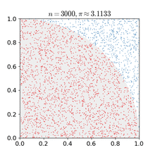

### About

In this lab, we will learn how to run a sensitivity analysis on the marketing use case, and how to generate random samples from a simple normal distribution similar to a Monte Carlo simulation.

### Note

Read carefully the instructions on Sakai. For clarity, questions are highlighted in red color and numbered according to their particular placement in the task section. Quite often you may need to add your own code chunk.

Execute all code chunks, save your work, preview, and submit your final $\it lab09.nb.html$ file in Sakai.

--------------

### Task 1: Sensitivity Analysis (total 12pts)

Sensitivity analysis is the study of how the uncertainty in the output of a mathematical model or system (numerical or otherwise) can be apportioned to different sources of uncertainty in its inputs. We will use the `lpSolveAPI` R-package as we did in the previous lab. 

In order to conduct a sensitivity analysis, we will need to download again the `lpSolveAPI` package unless you have it already installed in your R environment

```{r}
# Require will load the package only if not installed 
# Dependencies = TRUE makes sure that dependencies are install
if(!require("lpSolveAPI",quietly = TRUE))
  install.packages("lpSolveAPI",dependencies = TRUE, repos = "https://cloud.r-project.org")
```

We will revisit and solve again the marketing case discussed in class (also part of previous lab). 

```{r}
# We start with `0` constraint and `2` decision variables. The object name `lpmark` is discretionary.
lpmark = make.lp(0, 2)

# Define type of optimization as maximum and dump the screen output into a `dummy` variable
dummy = lp.control(lpmark, sense="max") 
# Set the objective function coefficients 
set.objfn(lpmark, c(275.691, 48.341))
```

Add all constraints to the model.

```{r}
add.constraint(lpmark, c(1, 1), "<=", 350000)
add.constraint(lpmark, c(1, 0), ">=", 15000)
add.constraint(lpmark, c(0, 1), ">=", 75000)
add.constraint(lpmark, c(2, -1), "=", 0)
add.constraint(lpmark, c(1, 0), ">=", 0)
add.constraint(lpmark, c(0, 1), ">=", 0)
```

Now, view the problem setting in tabular/matrix form. This is a good checkpoint to confirm that our contraints have been properly set.

```{r}
lpmark
# solve
solve(lpmark) 
```

Next we get the optimum results.
```{r}
# display the objective function optimum value
get.objective(lpmark)

# display the decision variables optimum values
get.variables(lpmark)
```

For sensitivity we will introduce the code command to obtain the sensitivities due to changes in resources as expressed in the right hand side (rhs) constraints. 

```{r}
# display sensitivity to rhs constraints. 
# There will be a total of m+n values where m is the number of contraints and n is the number of decision variables
get.sensitivity.rhs(lpmark) 
```

For this exercise we are only interested in the first six values (corresponding to the six constraints) of the output labeled `duals`. 

<span style="color:red">
##### 1A)  Identify the binding/non-binding constraints, the surplus/slack, the marginal values and explain what they represent in the context of the marketing use case. Use a separate line for each answer and avoid mixing with the red color!(4pts)
</span>

<span style="color:blue">
Binding constraints: 1, 4</br>
  - Constraint 1 marginal value = $124.12</br>
  - Constraint 4 marginal value = $75.78</br>

<span style="color:blue">
Marginal values are equal to the amount by which the objective sale will change, the rate/amount at which the optimum value is increased/decreased when the budget is increased/decreased by one unit (keeping all other variables constant). Binding resources imply the existence of maginal values, while non-binding resources imply the lack thereof.</br>

<span style="color:blue">
Non-binding constraints: 2, 3, 5, 6</br>
  - Constraint 2 surplus/slack = $116666.7 - $15000 = $101666.7</br>
  - Constraint 3 surplus/slack = $233333.3 - $75000 = $158333.3</br>

<span style="color:blue">
Surplus/slack is the difference between the optimum value of a constraint and its constraint value, which is the amount that constraint can be increased by without impacting the optimum value. Binding constraints do not have any room surplus/slack because any change will result in a change in the optimum values.
</span>

To acquire a better understanding of the sensitivity results, and to confirm integrity of the calculations, independent tests can be conducted.  To demonstrate, we will repeat the linear programming (LP) optimization problem by slightly tweaking one binding constraint and verifying the impact.

<span style="color:red">
##### 1B)  In the below code chunk start with a new model object `lpmark1`. Add the constraints exactly as demonstrated above. All being equal, change the first budget constraint by a marginal $1 value and solve the LP problem.  Note the new optimum value for sales. Calculate the change in optimum sales from the previous computed optimum sales. Compare your calculation to the sensitivity calculation obtained from the code command and confirm integrity (4pts)
</span>

```{r}
# Define a new model object called lpmark1
lpmark1 = make.lp(0, 2)
# Repeat rest of commands with the one constraint change for budget. Solve and display the objective function optimum value

# Define type of optimization as maximum and dump the screen output into a `dummy` variable
dummy = lp.control(lpmark1, sense="max") 

# Set the objective function coefficients 
set.objfn(lpmark1, c(275.691, 48.341))

# Add constraints
add.constraint(lpmark1, c(1, 1), "<=", 350001)
add.constraint(lpmark1, c(1, 0), ">=", 15000)
add.constraint(lpmark1, c(0, 1), ">=", 75000)
add.constraint(lpmark1, c(2, -1), "=", 0)
add.constraint(lpmark1, c(1, 0), ">=", 0)
add.constraint(lpmark1, c(0, 1), ">=", 0)

# Run 'lpmark1'
lpmark1

# Solve 'lpmark1'
solve(lpmark1)

# display the objective function optimum value for 'lpmark1'
get.objective(lpmark1)

# display the decision variables optimum values for 'lpmark1'
get.variables(lpmark1)

# Calculate change in optimum sales
sales_change = get.objective(lpmark1) - get.objective(lpmark)
sales_change

# Check integrity of sensitivity analysis, adjust logic equation for rounding error
if (sales_change >= 124.1243) {
  print('Valid sensitivity analysis integrity')
}
```

<span style="color:red">
##### 1C)  Following the logic of calculations in 1B) and without introducing a new code chunk, explain the steps you would follow to validate the integrity of the second remaining marginal value identified in 1A). Use a different line to explain each step (4pts)
</span>

<span style="color:blue">
1) Reset the 1st constraint from 350001 to 350000</br>
2) Increase the 4th constraint from 0 to 1</br>
3) Get the decision variable's optimum value</br>
4) Calculate the change in optimum sales</br>
5) Validate the integrity of the sensitivity analysis by confirming the change in optimum sales equals 4th constraint decision variable's optimum value in `lpmark`
</span>

----------

### Task 2: Random Sampling & Monte Carlo Simulation (total 8pts)

Monte Carlo Simulations utilize repeated random sampling from a given universe or population distribution to derive certain results. This type of simulation is known as a probabilistic simulation, as opposed to a deterministic simulation.

An example of a Monte Carlo simulation is the one applied to approximate the value of `pi`. The simulation is based on generating random points within a unit square and see how many points fall within the circle enclosed by the unit square (marked in red). The value of `pi` is estimated by the number of points inside the circle over the total number of points generated inside the square.  The higher the number of sampled points the closer the result is to the actual result.  After selecting 30,000 random points, the estimate for `pi` is much closer to the actual value within the four decimal points of precision. You are encouraged to explore the mathematical foundation behind the logic.




For this task we will be running a Monte Carlo simulation to calculate the probability that the daily return from S&P will be > 5%. 
We will assume that the historical S&P daily return follows a normal distribution with an average daily return of 0.03 (%) and a standard deviation of 0.97 (%). Consider this as our population.

To begin we will generate 100 random samples from the normal distribution. For the generated samples we will calculate the mean, standard deviation, and probability of occurrence where the simulation result is greater than 5%. 

To generate random samples from a normal distribution we will use the `rnorm()` function in R. In the example below we set the number of runs (or samples) to 100.

```{r}
# number of simulations/samples
runs = 100
# random number generator per defined normal distribution with given mean and standard deviation
sims =  rnorm(runs,mean=0.03,sd=0.97)
```

```{r}
# Mean calculated from the random distribution of samples
average1 = mean(sims)
average1
```

```{r}
# STD calculated from the random distribution of samples
std1 = sd(sims) 
std1
```

```{r}
# probability of occurrence on any given day based on samples will be equal to count (or sum) where sample result is greater than 5% divided by total number of samples. 
prob1 = sum(sims >=0.05)/runs
prob1
```

<span style="color:red">
##### 2A)  Repeat the above calculations for the two cases where the number of simulations/samples is equal to 1000 and 10000.  For each case record the mean, standard deviation, and probability (4pts)
</span>

````{r}
# 1000 of simulations/samples
runs = 1000

# random number generator per defined normal distribution with given mean and standard deviation
sims =  rnorm(runs,mean=0.03,sd=0.97)

# Mean calculated from the random distribution of samples
average2 = mean(sims)
average2

# STD calculated from the random distribution of samples
std2 = sd(sims) 
std2

# probability of occurrence on any given day based on samples will be equal to count (or sum) where sample result is greater than 5% divided by total number of samples. 
prob2 = sum(sims >=0.05)/runs
prob2

# 10000 of simulations/samples
runs = 10000

# random number generator per defined normal distribution with given mean and standard deviation
sims =  rnorm(runs,mean=0.03,sd=0.97)

# Mean calculated from the random distribution of samples
average3 = mean(sims)
average3

# STD calculated from the random distribution of samples
std3 = sd(sims) 
std3

# probability of occurrence on any given day based on samples will be equal to count (or sum) where sample result is greater than 5% divided by total number of samples. 
prob3 = sum(sims >=0.05)/runs
prob3
```

<span style="color:red">
##### 2B)  Write in separate lines the values for mean, standard deviation, and probability for all three cases: 100, 1000, and 10000 simulations. Observe how the values change/behave as the number of simulations is increased. Based on your observation what is your best bet on the probability of occurrence greater than 5%? Explain your logic and how is this behavior similar to the use case demonstration to calculate `pi`?  (4pts) 
</span>

<span style="color:blue">
100 case:</br>
Mean: 0.05435172</br>
SD: 0.9423248</br>
Probability: 0.53</br>

<span style="color:blue">
1000 case:</br>
Mean: 0.01859403</br>
SD: 0.9532823</br>
Probability: 0.487</br>

<span style="color:blue">
10000 case:</br>
Mean: 0.02536076</br>
SD: 0.9806386</br>
Probability: 0.486</br>

<span style="color:blue">
It seems as though running 100 simulations is the best bet for yielding a mean greater than 5%, as the probability is `0.53` while the other two are both slightly below less. It is possible that this is just a random coincidence, as the mean, SD, and probability would change every time the simulations are run. Although the variation isn't as significant in these executions, this behavior is similar to the `pi` case because as more simulations are run, the closer the mean gets to an actual mean and probability the daily return from S&P will be greater than 5%.
</span>