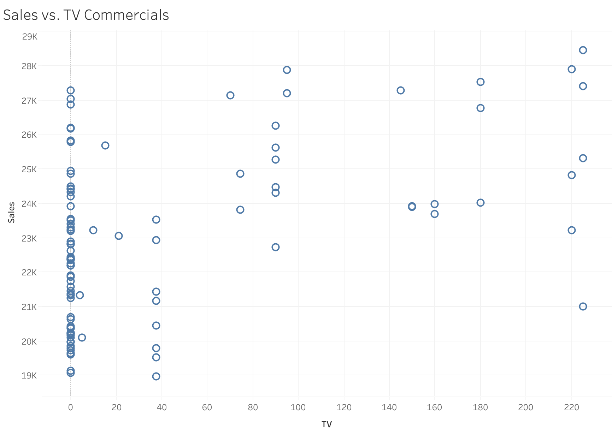
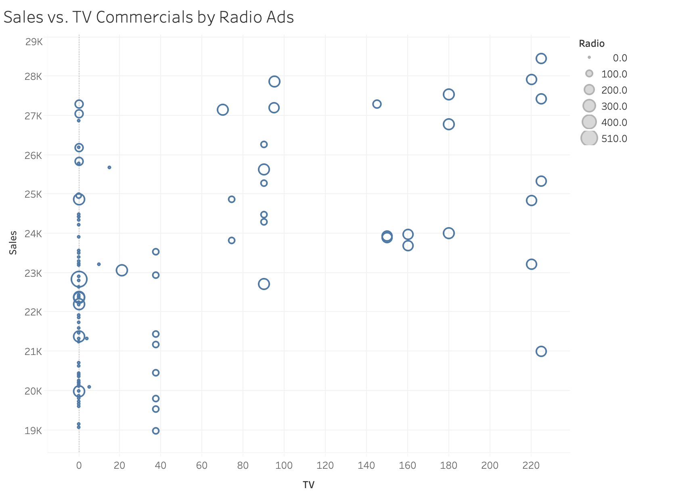
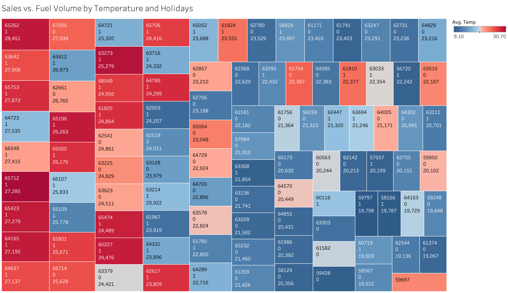
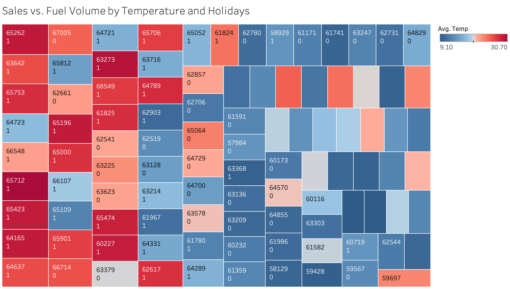
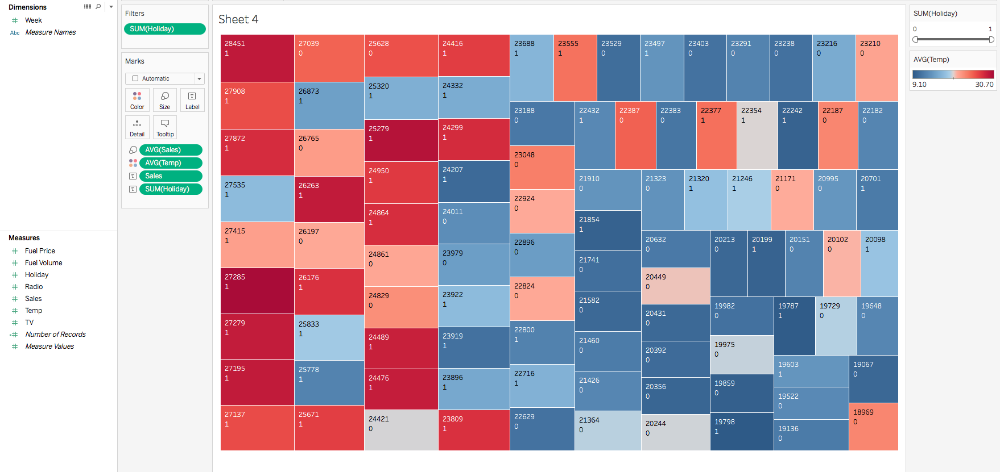

### About

For this lab, we will be using Tableau to learn some basic concepts in visual analytics to identify data outliers, seasonality effects, relationships and impacts. There is no R coding in this lab session.

Every plot should be accompanied with a brief explanation on what the data is telling us.  The explanation should consider all variables included in a plot and what possible [actionable] insights can be derived.

### Note

Read carefully the instructions on Sakai. For clarity, questions are highlighted in red color and numbered according to their particular placement in the task section. Quite often you may need to add your own code chunk.

Execute all code chunks, save your work, preview, and submit your final $\it lab11.nb.html$ file in Sakai.

--------------

### Task 1: Data Outliers and Seasonality Effect (total 6pts)

First get familiar with the data and what each column represent. A description of the data can be found in the Excel file in a seperate sheet called 'Desc'. Refer to early lab exercise on how to use Tableau.   Also check the quick Tableau get started guide published on Sakai. Note that this time you will be reading an Excel file of type `xls` (unlike `csv`) into Tableau. Once the file is read into Tableau you will need to select the Data sheet for your work. 

Go to the worksheet, select and drag the measure Sales and drop into Rows.  Similarly drag the dimension Week and drop into Columns. You should see a line plot of Sales versus Week.  

You can go to the Worksheet tab located in the top menu bar, and select export->image to save a copy of the image plot.

##### 1A) Include a copy of your image plot, and explain the reason behind any odd behavior you observe.

 vs. Week.png)

Weeks 23-25 have only one row per week, while the rest of the weeks have two rows per week.

Next we will modify the plot to adjust for any odd behavior. For this you will need to pull the drop-down menu by clicking the down arrow visible once you hover with the mouse over the variable name in the Rows or Columns field.

##### 1B) From the drop-down menu switch the measure from sum SUM(Sales) to average AVG(Sales). Double-click on the Sales y-axis and change the scale to be more representative of the data range. This should provide a better view of the data. Include a copy of the new image plot.  Explain how the switch from sum SUM(sales) to average AVG(Sales) helped mitigate the observed odd behavior in 1A).

 vs. Week.png)

By averaging the sales data, it consolidates all the rows for each week into its respective row, which mitigates the difference between weeks 23-25 with their single rows and the other weeks with two each

##### 1C)  Drag the measure Temp to the Color box found in `Marks`.  With the mouse hover over the SUM(Temp) and from the drop-down menu change the measure to AVG(Temp). Double-click the color legend bar and edit the colors legend to be more representative of hot and cold temperatures (red for hot, and blue for cold). Include a copy of the image plot.  Explain the combined behavior of Sales, Week, and Temp.

 vs. Week by Temperature.png)

When the temperature is higher, typically during the Spring and Summer months, sales tend to be higher. When the temperature is lower, typically during the Winter and Fall months, sales tend to be lower.

----------

### Task 2: Relationships and Impacts (total 14pts)

In a new worksheet (#2), follow the directions to answer the questions.

##### 2A) Drop the measure Sales into Rows and the measure TV into Columns. Switch both measures from SUM() to Dimension using the drop-down menu associated with each variable.  The plot should now look like a scatter plot. Include a copy of the image plot. Explain the overall behavior (i.e. trend) of Sales versus TV. Ignore for now the values at zero.  From the plot can you identify an upper threshold for TV beyond which any increase in TV would have little or no impact on Sales?

There seems to be a slight positive trend between sales and TV commercials. There does not seem to be an upper threshold for TV beyond which an increase in TV would have little or no impact on sales.

##### 2B) Drag the measure Radio to the box Size found in Marks. Include a copy of the image plot here. Explain what impact the addition of Radio ads to TV ads is having on Sales. Ignore again the values at zero.

Adding radio ads to TV commercials shows that the higher sales volumes typically have some investment in radio ads in addition to TV commercials.

In a new worksheet (#3), follow the directions to answer the questions.

##### 2C) Follow the steps in 2A to create a scatter plot of Sales versus Fuel Volume. Explain behavior.  No need to include a copy image.

There seems to be a strong, positive trend between sales and fuel volume.

##### 2D) Drag the measure Temp to `Color`  found in Marks. Follow instructions in 1C) to change SUM(Temp) to AVG(Temp), and to edit the color legend for Temp. Explain the impact of the added temperature measure on Sales. No need to include a copy image.

When the temperature is higher sales and fuel volumes tend to be higher. When the temperature is lower sales and fuel volumes tend to be lower.

##### 2E) Drag the measure Holiday to `Label` found in Marks.  Include a copy of the image plot.  Write a small paragraph to explain the integrated impact of Temp, Holiday, and Fuel Volume on Sales.

When the temperature is higher and it is a holiday, sales and fuel volumes tend to be higher. When the temperature is lower and it is not a holiday, sales and fuel volumes tend to be lower.

Using previous worksheet (#3) follow the directions to answer the questions.

##### 2F) From the `Show Me` menu switch the view to treemap to show the combined effect of Sales, Temp, Holiday, and Fuel Volume. Re-organise the treemap so Sales is represented by `Size`, Temp by `Color`, Holiday by `Label`, and Fuel Volume by `Label`. A sample treemap view is shown below.  You may want to adjust the size of your Tableau window to full screen for a better view. Add a Quick Filter to Holiday and Temp. To create a filter simply hover with the mouse over the measure and select `Show Filter` from the drop-down menu.  With a quick filter one can adjust the values with a sliding bar to better assess impact.  Include a copy of the image plot.

The last step is a summary of your findings and possible actionable insights.

##### 2G) Write a small paragraph (about five lines) summarizing your findings on how the different measures work together or independently, and under what conditions, to impact Sales. This is the end of your data story!

From the treemap I created, it would seem that the highest average sales volumes tend to be characterized by higher fuel volumes, days in which holidays occur, and higher average temperatures. Days in which holidays occur and average temperature seem to work together, in which holidays and higher average temperatures tend to result in higher sales volumes, and vice versa. Fuel volumes seem to work independently, in which higher fuel volumes tend to result in higher sales volumes, and vice versa.

